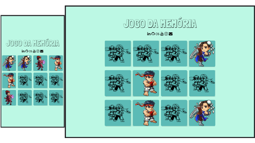

# Jogo da Memória

### Bootcamp JavaScript Game Developer DIO

###### Desafio: Criar o Jogo da Memória usando HTML CSS e JavaScript

## 👁️‍🗨️ Preview

Link para visualizar: [Ver Demo](https://sandra-silva-santos.github.io/Jogo-da-Memoria/)

## 🛠️ **Tecnologias**

  
